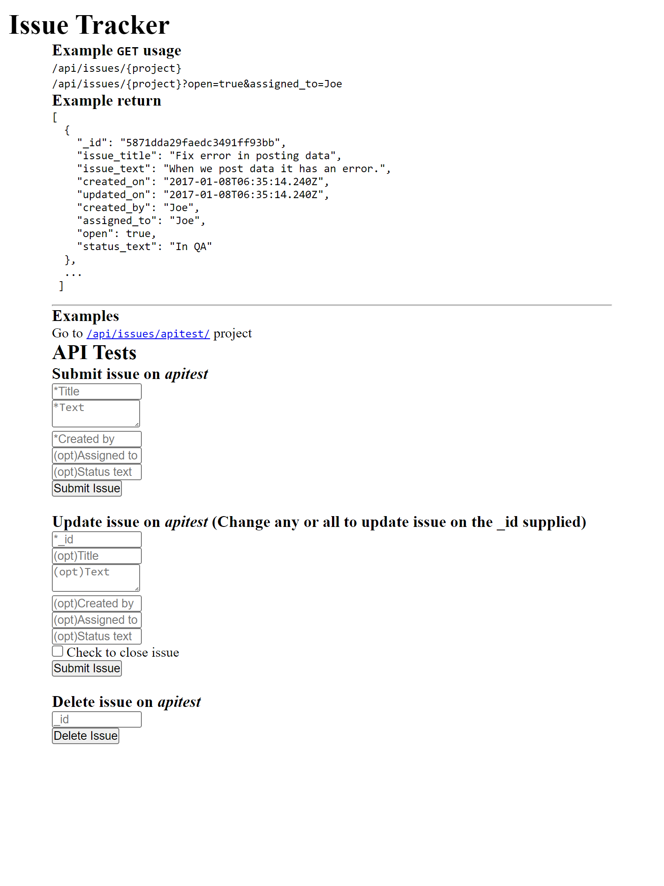

# Issue Tracker

This is the boilerplate for the Issue Tracker project. Instructions for building your project can be found at https://www.freecodecamp.org/learn/quality-assurance/quality-assurance-projects/issue-tracker

# [freeCodeCamp Quality Assurance certification](https://www.freecodecamp.org/learn/quality-assurance/)

## [Issue Tracker](https://www.freecodecamp.org/learn/quality-assurance/quality-assurance-projects/issue-tracker)

Working example: https://app-issue-track.herokuapp.com/

My git repo: https://github.com/Raff1010X/01.Roadmap

